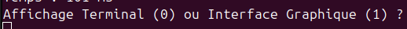
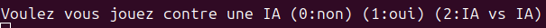
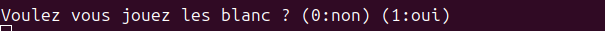
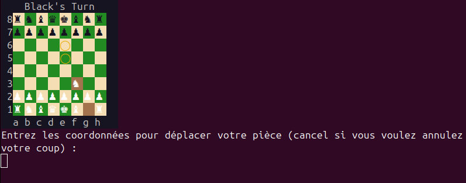
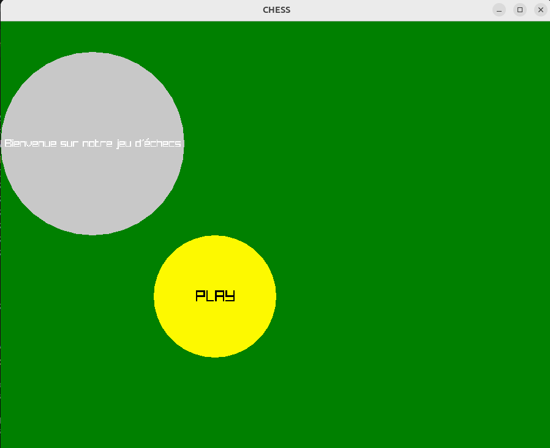
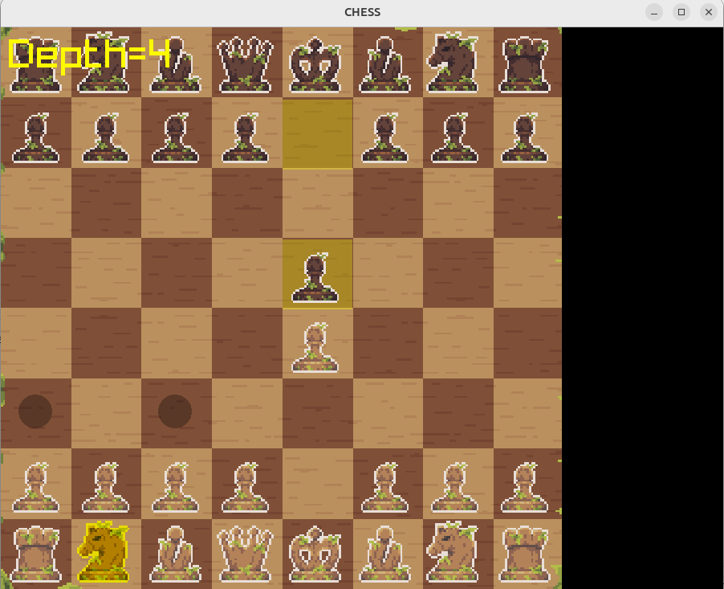

---
header-includes:
  - \usepackage{graphicx}
  - \usepackage{titlesec}

include-before: |
  \begin{titlepage}
    \centering

    \includegraphics[width=10cm]{image/logo_upvd.png} \\[1cm]

    {\Large \textbf{Génie Logiciel -- L3 Informatique} \\[0.5cm]}
    {\Large \textbf{31 mars 2026} \\[0.5cm]}
    
    \rule{.8\linewidth}{0.5mm} \\[0.5cm]
    {\Huge \textbf{Rapport du projet : \\ IA d'Échecs}} \\[0.5cm]
    \rule{.8\linewidth}{0.5mm} \\[1.5cm]
    
    {\Large FAVRIOU Valentin \\ 
    ARANEGA Noah \\[1cm]}

    {\Large Encadrant: ANTUNES Benjamin \\[1cm]}
      
  \end{titlepage}
---

\newpage

# Table des Figures

- [Figure 1](#fig:img1) Capture d'écran personnelle 
- [Figure 2](#fig:img2) Capture d'écran personnelle 
- [Figure 3](#fig:img3) Capture d'écran personnelle 
- [Figure 4](#fig:img4) Capture d'écran personnelle 
- [Figure 5](#fig:img5) Capture d'écran personnelle 
- [Figure 6](#fig:img6) Capture d'écran personnelle 

\clearpage

# Introduction

Le jeu d'échecs est un des jeux les plus anciens de l'histoire qui est encore populaire de nos jours. Faisant son apparition autour du 6ème siècle après J-C, il mélange stratégie, anticipation, prise dé decisions  dans un environnement complexe et réflexion du joueur.  

Le jeu d'échecs oppose deux armées, une blanche et une noire, composées de 8 pions, 2 fous, 2 cavaliers, 2 tours, 1 reine et 1 roi sur un plateau de 8 cases par 8 cases. Le but est de mettre en échec et mat le joueur adverse, c'est-à-dire de faire en sorte que le roi soit attaqué sans que le joueur puisse le bouger ou le défendre.

Chaque pièce a des déplacements spéciaux:  
- Le **pion** peut se déplacer en avant d'une case sauf si la case est bloquée par une autre pièce. Son premier coup peut avancer de deux cases, et il ne peut manger une pièce que si elle se trouve en diagonale une case devant elle.  
- Le **fou** peut se déplacer qu'en diagonale, il ne peut pas passer à travers une pièce mais peut la manger si elle se trouve dans ses diagonales.  
- Le **cavalier** peut se déplacer en forme de L, il peut passer au dessus de n'importe quelle pièce et peut la manger si elle se trouve sur sa case de déplacement. (ex: si le cavalier se trouve en (5,5), il peut aller en (3,6), (3,4), (7,6), (7,4), (6,3), (4,3), (6,7) et (4,7).)  
- La **tour** peut se déplacer verticalement et horizontalement (dans sa colonne et sa ligne), tout comme le fou il ne peut pas passer au dessus d'une pièce mais il peut la manger si elle est sur son chemin.  
- La **reine** hérite des déplacements de la tour et du fou, elle peut se déplacer en diagonales et sur sa ligne et sa colonne.  
- Le **roi** peut bouger d'une case dans toutes les directions (nord, est, sud, ouest, nord-est, sud-est, sud-ouest et nord-ouest), mais il doit faire attention à ne pas être en échec s'il se déplace sur une de ces cases.  

Le jeu d'échecs est un jeu très complexe qui requiert beaucoup de capacités intellectuelles pour pouvoir anticiper plusieurs coups d'avances et par conséquent être fort à ce jeu. L'Intelligence Artificielle (IA) a réussi à impacter ce jeu, notamment en 1997 lorsque le superordinateur IA Deep Blue bat le champion du monde Garry Kasparov. 

Cet épisode de l'histoire des échecs nous a inspiré à recréer une IA qui soit capable de jouer aux échecs de manière autonome, en analysant la meilleure décision à prendre dans chaque position où elle se trouve.

Ce rapport présentera tout d'abord l'application que l'on a conçue, pour ensuite présenter l'architecture logicielle, suivi du diagramme des classes UML de notre projet, nous rebondirons ensuite sur les patrons de conceptions que nous avons utilisé pour notre projet, puis nous aborderons ensuite les outils logiciells utilisés, les tâches effectuées et les difficultés rencontrées.

# Présentation de l'Applicaton

## Contenu de l'application

Nous avons réaliser ce projet d'IA d'échecs dans le cadre de nos études, au cours de la matière Génie Logiciel. L'objectif de cette application est de pouvoir jouer aux échecs, sur terminal ou via une interface graphique sous raylib, contre une intelligence artificielle ou un autre joueur sur la même machine.  
L'application contient un plateau d'échecs avec toutes les pièces à disposition que l'on peut déplacer sous la contrainte des règles officielles du jeu d'échecs. Elle dispose d'une IA qui se base sur l'algorithme de recherche "minimax" pour pouvoir trouver le coup le plus optimal. Il est aussi possible d'annuler le dernier coup de l'adversaire ou son propre coup grâce à un historique de coup. La configuration des joueurs (IA ou humains) se fait via le terminal, et il est possible de choisir son camp si on joue contre une IA.  

## Utilisation de l'application

Pour utiliser l'application, il faut avoir docker ou guix d'installé et suivre les instructions d'exécutions présentes dans le README.md du projet.  
Après exécution, il y a tout d'abord une demande faite à l'utilisateur pour qu'il choisisse entre l'affichage graphique ou terminal, en mettant 0 pour l'affichage sur terminal et 1 pour l'affichage graphique.  

{#fig:img1}

Ensuite, après avoir choisi l'affichage utilisé, l'utilisateur doit ensuite choisir si la partie d'échecs opposera (0) deux joueurs, un joueur vs une IA (1) ou alors deux IA (2).  

{#fig:img2}

S'il a choisit de jouer contre une IA, il doit alors choisir s'il joue les blancs ou non.  

{#fig:img3}

Pour l'affichage terminal, le joueur doit écrire la position de la pièce qu'il veut bouger (ex: a7), puis l'emplacement où il vevut la bouger.

{#fig:img4}  

Pour l'affichage graphique, il y a d'abord un menu contenant un bouton play sur lequel le joueur doit appuyer pour jouer, puis le plateau s'affiche avec toutes les pièces. Pour déplacer une pièce, le joueuur doit cliquer dessus puis cliquer sur un emplacement valable où il peut la déplacer.

{#fig:img5}

{#fig:img6}

\clearpage
# Présentation de l'architecture logicielle

L’application a été conçue selon une architecture modulaire, permettant de séparer clairement les différentes responsabilités du système. Cette organisation facilite la compréhension, la maintenance et l’évolution du code.

L’architecture repose sur plusieurs composants principaux :  
Tout d’abord, la gestion du jeu est assurée par un ensemble de classes représentant les éléments fondamentaux des échecs. La classe Piece constitue une classe de base dont héritent les différentes pièces du jeu telles que Pawn, Rook, Knight, Bishop, Queen et King. L’échiquier et les positions sont gérés à l’aide des classes Player et Coordinates, permettant de représenter l’état du jeu à tout instant.

La logique du jeu est centralisée dans la classe GameController, qui gère le déroulement d’une partie, les déplacements des pièces, ainsi que les règles du jeu (déplacements valides, échecs, captures, etc.). Cette classe joue un rôle central dans la coordination des différents composants du projet.

Le module d’intelligence artificielle est principalement composé des classes Minimax et Evaluator. La classe Minimax implémente un algorithme de recherche permettant d’explorer les coups possibles afin de déterminer le meilleur choix. Elle s’appuie sur la classe Evaluator, qui attribue un score à une position donnée en fonction de différents critères (valeur des pièces, position sur l’échiquier, etc.). Cette séparation permet de distinguer clairement la logique de recherche de celle d’évaluation.

L’interface utilisateur est divisée en deux parties : une interface graphique (GraphicDisplay) et une interface terminale (TerminalDisplay). Ces composants permettent d’interagir avec le joueur et d’afficher l’état du jeu. Des classes supplémentaires telles que Button, Shape ou TextShape sont utilisées pour gérer les éléments graphiques.

Enfin, des classes utilitaires comme MoveHistory permettent de suivre les coups joués, tandis que Player représente les joueurs et leurs pièces.

Les différents modules interagissent de manière structurée. Par exemple, l’intelligence artificielle utilise l’état du jeu fourni par GameController pour simuler des coups, tandis que l’interface récupère ces informations pour les afficher à l’utilisateur.

Cette architecture repose sur une séparation claire des responsabilités, rendant le code plus modulaire, maintenable et évolutif.

# Diagramme de classes UML

# Diagramme de séquence UML

# Patrons de Conception utilisés
Les deux patrons de conceptions principaux qui ont été utilisés sont les suivants :

## Modèle-Vue-Controlleur  
L'application est séparée en trois parties distinctes:  

1) **Modèle**:  
La partie modèle est le cœur des données et de la logique. Elle contient les données, les règles du jeu et les calculs. Elle contient les les classes suivantes: Piece et tout ce qui en hérite (Knight, Pawn, Bishop...), Player, Coordinates, Evaluator, Minimax et MoveHistory.

2) **Vue**:  
La partie Vue (View) consiste à l'affichage des données pour l'utilisateur, et son interface. Elle comprend les classes suivantes : Display, TerminalDisplay, GraphicDisplay, Drawable, Shape, Button, TextShape, CircleShape et GameAsset.

3) **Controlleur**:  
Et enfin, la partie controlleur est le "chef d'orchestre", elle reçoit les actions utilisateurs, modifie le modèle et met à jour la vue. Elle contient donc la classe GameController, Screen, ScreenChess et ScreenMainMenu.

## Memento
Le patron de oconception Memento est utilisé pour sauvegarder chaque coup effectué par l'utilisateur ou l'IA, et de pouvoir restaurer un état précédent sans exposer les détails internes.  
Il est modélisé par la classe MoveHistory qui contient la copie d'un mouvement fait précédemment, dont le controlleur se sert pour pouvoir annuler un coup, et dont l'IA se sert pour explorer des mouvements.

# Outils logiciels utilisés
## Langage et compilation
Ce projet a été développé en **C++20**, un langage de programmation compilé offrant
des performances élevées, adaptées aux algorithmes de recherche
intensifs comme le Minimax. La compilation est gérée par un **Makefile** utilisant
**g++** avec les flags d'optimisation `-O2` pour les builds de production et `-g`
pour le débogage.

## Bibliothèque graphique
L'interface graphique a été réalisée à l'aide de **Raylib**, une bibliothèque C
légère et multiplateforme orientée jeu vidéo. Elle nous a permis de gérer
l'affichage du plateau, des pièces, et les interactions souris

## Environnements de développement
Deux environnements ont été utilisés selon les besoins :

- **Docker** : un conteneur basé sur Ubuntu 22.04 garantit un environnement
  de compilation reproductible et isolé, facilitant le déploiement et
  l'intégration continue. Il embarque toutes les dépendances nécessaires
  (Raylib, g++, CMake, Valgrind).

- **Guix** : un gestionnaire de paquets fonctionnel utilisé pour le
  développement local. Contrairement à Docker, Guix s'exécute directement
  sur la machine hôte, offrant un accès natif à l'affichage X11 sans
  configuration supplémentaire. La commande `guix shell --manifest=guix.scm`
  instancie un environnement isolé avec exactement les paquets déclarés.

## Débogage et analyse mémoire
**Valgrind** a été utilisé pour détecter les fuites mémoire et les accès
invalides, notamment sur les structures de données complexes comme les
`shared_ptr` et les vecteurs de pièces.

## Gestion de versions
Le projet a été versionné avec **Git** et hébergé sur **GitHub**, permettant
une collaboration efficace entre les membres de l'équipe et un suivi précis
de l'historique des modifications.

## Parallélisme
La recherche du meilleur coup par l'IA exploite le parallélisme système via
les appels **POSIX** `fork()` et `pipe()`. Chaque coup candidat à la racine
de l'arbre Minimax est évalué dans un processus fils indépendant, les
résultats étant renvoyés au processus père via des tubes de communication.

# Tableau des Tâches
\begin{center}
\begin{tabular}{|c|l|c|c|c|}
\hline
\textbf{Tâche} & \textbf{Description} & \textbf{Dépendance} & \textbf{Temps estimé} & \textbf{Qui ?}\\
\hline
A & Classe Coordinates & - & 1 jour & Valentin\\
\hline
B & Classe Piece & A & 2 Jours & Noah\\
\hline
C & Classe Player & B & 3 Jours & Noah\\
\hline
D & Classe GameController & C & 7 Jours & Noah, Valentin\\
\hline
E & Classe Evaluator & D & 1 Jours & Valentin\\
\hline
F & Classe Minimax & E & 10 Jours & Valentin\\
\hline
G & Interface Terminal & D & 2 Jours & Noah\\
\hline
H & Interface Graphique & D & 5 Jours & Valentin\\
\hline
\end{tabular}
\end{center}

\begin{itemize}
    \item A → B → C → D → E → F
    \item D → G
    \item D → H
\end{itemize}
# Difficultés rencontrées
## Gestions des coups illégaux / reglès du jeu
La gestion correcte des règles du jeu (déplacements valides, détection d’échec, captures, enPassant) a constitué une certaine difficulé, 
notamment pour garantir la validité des positions générées lors de la recherche Minimax.

## Equilibrage de l'évaluation
Le choix de la fonction d’évaluation a été difficile, car il fallait trouver un équilibre entre précision et rapidité de calcul. 
Une évaluation trop simple rend l’IA faible, tandis qu’une évaluation trop complexe ralentit fortement la recherche.

## Compléxité de l'algorithme Minimax
L’implémentation de l’algorithme Minimax a posé des difficultés en raison de la complexité exponentielle du nombre de positions à explorer. 
Sans optimisation, les temps de calcul devenaient rapidement trop importants, rendant l’IA peu réactive.\
Chaque Demi-coups suplémentaire c'est environ 20x plus de coups sans optimisation. Voici un tableau représentant l'association profondeur->nombre de coups possible
\begin{center}
\begin{tabular}{|c|l|c|c|}

\hline
\textbf{Profondeur en Demi-coups} & \textbf{Nombre de coups Possible}\\
\hline
1 & 20\\
\hline
2 & 420\\
\hline
3 & 9 322\\
\hline
4 & 206 599\\
\hline
5 & 5 072 033\\
\hline
6 & environ 124 000 000\\
\hline
7 & environ 3 319 000 000\\
\hline
8 & Trop long à calculé\\
\hline

\end{tabular}
\end{center}

## Optimisation alpha-beta & heuristiques
Afin de réduire le nombre de positions explorées, plusieurs optimisations ont été nécessaires, comme l’élagage alpha-bêta, ainsi que des heuristiques de tri des coups (killer move, history heuristic). Leur mise en place a nécessité une bonne compréhension des interactions entre ces techniques.
Voici un tableau représentant l'association profondeur -> nombre de coups possible en utilisant l'élagage alpha-bêta
\begin{center}
\begin{tabular}{|c|l|c|c|}
\hline
\textbf{Profondeur en Demi-coups} & \textbf{Nombre de coups Possible}\\
\hline
1 & 20\\
\hline
2 & 125\\
\hline
3 & 1 191\\
\hline
4 & 7 470\\
\hline
5 & 167 120\\
\hline
6 & 715 953\\
\hline
7 & 6 756 624\\
\hline
8 & environ 47 000 000\\
\hline
\end{tabular}
\end{center}

Comme on peut le voir sur le tableau , l'élagage alpha-bêta a permis de réduire le nombre de coups exploré.

## Parallélisme
La mise en place du parallélisme via les appels système fork() et pipe() a représenté une petite difficulté technique. 
Il a fallu gérer correctement la communication et la terminaison des processus , ainsi que la synchronisation des résultats.

\clearpage
# Conclusion

Au cours de ce projet, nous avons développé une application complète de jeu d’échecs intégrant une intelligence artificielle basée sur l’algorithme Minimax. Ce travail nous a permis de mettre en pratique des notions fondamentales du génie logiciel, telles que la conception orientée objet, l’utilisation de diagrammes UML et la mise en place d’une architecture logicielle structurée de type Modèle-Vue-Contrôleur.

L’application réalisée est fonctionnelle et permet de jouer aussi bien contre un autre joueur que contre une intelligence artificielle, via une interface graphique ou terminale. L’intégration de l’algorithme Minimax, combiné à des optimisations comme l’élagage alpha-bêta, nous a permis d’obtenir une IA capable de prendre des décisions cohérentes dans un temps raisonnable.

Ce projet nous a également permis de développer des compétences importantes, notamment en programmation C++, en conception logicielle, ainsi qu’en optimisation algorithmique. Les principales difficultés rencontrées ont concerné la gestion des règles complexes du jeu d’échecs et la maîtrise de la complexité de l’algorithme Minimax, ce qui nous a amenés à approfondir notre compréhension de ces concepts.

Plusieurs améliorations pourraient être apportées à ce projet. Il serait notamment possible d’enrichir la fonction d’évaluation de l’IA, d’ajouter une interface utilisateur plus avancée ou encore d’implémenter un mode multijoueur en réseau. De plus, l’intégration de techniques avancées comme les tables de transposition permettrait d’améliorer significativement les performances de l’IA.

En conclusion, ce projet constitue une expérience enrichissante qui nous a permis de consolider nos compétences en développement logiciel et de mieux appréhender les enjeux liés à la conception d’une intelligence artificielle dans un environnement complexe.
